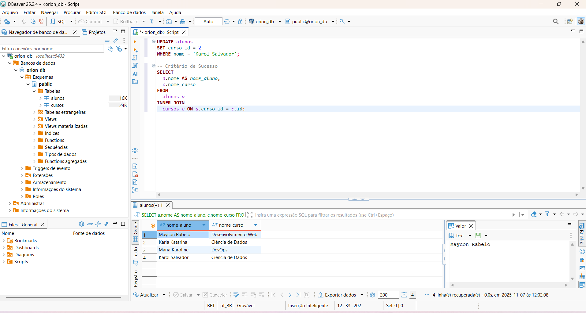
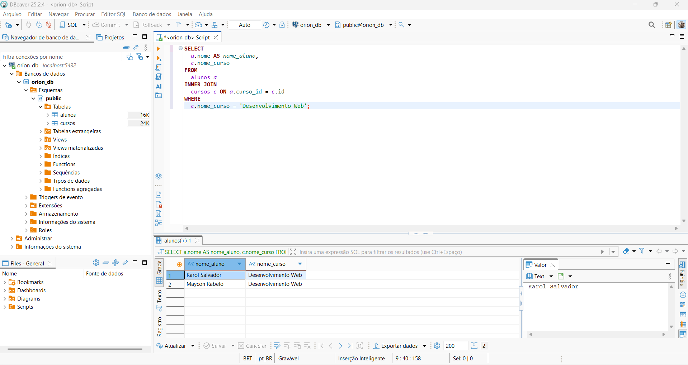
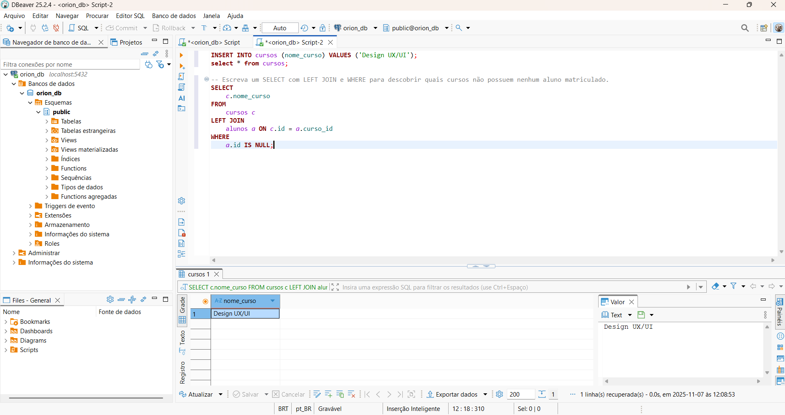
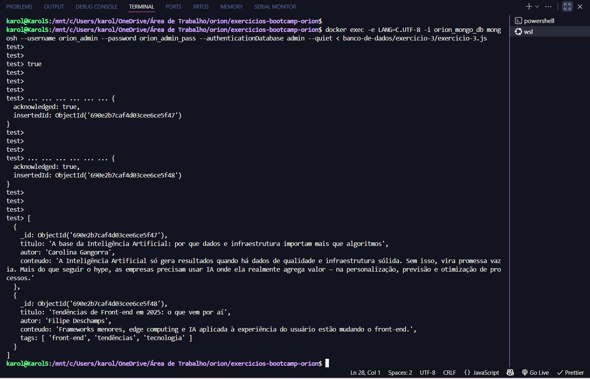
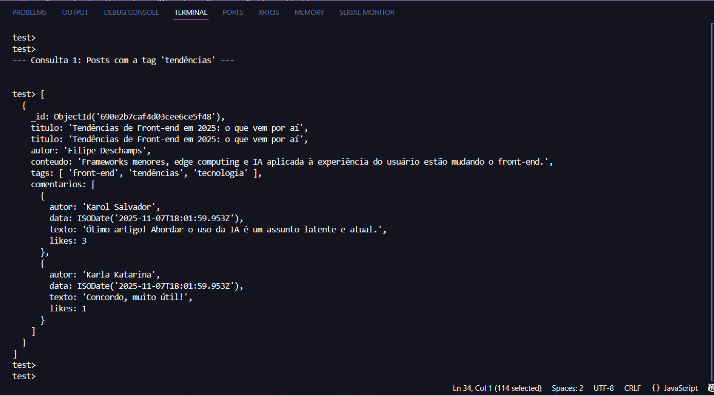
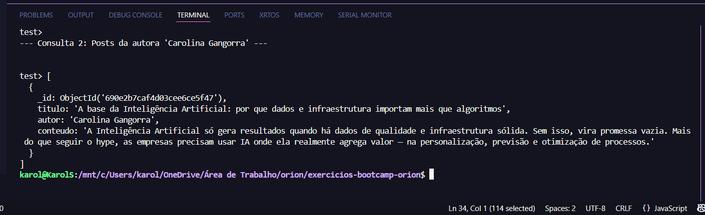

# 💾 Módulo Banco de Dados (SQL & NoSQL)

Este módulo contém a solução para os exercícios práticos que abordam conceitos de bancos de dados relacionais (**PostgreSQL** - SQL Básico e Avançado) e não relacionais (**MongoDB** - CRUD e Consultas Avançadas), além da orquestração de ambientes **Dev/Prod** com Docker Compose.

---

## 🚀 Tecnologias Utilizadas

| Tecnologia           | Finalidade                                                    |
| :------------------- | :------------------------------------------------------------ |
| **PostgreSQL 16**    | Banco de dados Relacional para os Exercícios 1 e 2.           |
| **MongoDB (Latest)** | Banco de dados Não Relacional para os Exercícios 3 e 4.       |
| **Docker Compose**   | Orquestração do ambiente (`postgres` e `mongo`).              |
| **DBeaver**          | Cliente SQL/NoSQL utilizado para validação e _prints_ limpos. |

<div align="center">
  
  
  
</div>

---

## 📂 Estrutura do Módulo

Os exercícios foram organizados para isolar as soluções e facilitar a validação:  
banco-de-dados/  
├── assets/ # Pasta com os prints de validação
├── exercicio-1/ # SQL Básico (CREATE, INSERT, PK, FK)  
│ └── exercicio-1.sql  
├── exercicio-2/ # SQL Avançado (JOINs, WHERE, UPDATE, LEFT JOIN)  
│ └── exercicio-2.sql  
├── exercicio-3/ # NoSQL CRUD (Schema Flexível)  
│ └── exercicio-3.js  
├── exercicio-4/ # NoSQL Avançado (UPDATE com Array, Consultas)  
│ └── exercicio-4.js  
├── docker-compose.yml # Arquivo base para iniciar o ambiente  
├── docker-compose.dev.yml # Orquestração para ambiente de Desenvolvimento  
├── docker-compose.prod.yml # Orquestração para ambiente de Produção  
└── README.md

## ⚙️ Guia de Execução

1.  **Subir o Ambiente:** Navegue até a pasta `banco-de-dados` e utilize o `docker-compose.yml` base:
    ```bash
    docker compose up -d
    ```
2.  **Acessar o PostgreSQL:** Conecte o DBeaver na porta **5432** (Host: `localhost`, DB: `orion_db`, User: `orion_user`).
3.  **Acessar o MongoDB:** Conecte o DBeaver na porta **27017** (Host: `localhost`, Auth DB: `admin`, User: `orion_admin`).
4.  **Executar Soluções:** Execute os scripts `.sql` e `.js` nos seus respectivos _shells_ ou clientes SQL.

---

## ✅ Resumo dos Critérios de Sucesso e Provas Visuais

### 1. SQL Básico (Exercício 1)

**Objetivo:** Criar tabelas com Chaves Primárias (PK) e Chaves Estrangeiras (FK).

| Requisito           | Comando Executado                                                                |
| :------------------ | :------------------------------------------------------------------------------- |
| **Sintaxe DDL/DML** | `CREATE TABLE cursos`, `CREATE TABLE alunos (com CONSTRAINT FK)`, `INSERT INTO`. |
| **Prova Visual**    | O resultado do `SELECT * FROM alunos` após a criação e inserção de dados.        |


### 2. SQL Avançado (Exercício 2 & Extra)

**Objetivo:** Usar `INNER JOIN`, `WHERE`, `UPDATE` e `LEFT JOIN` (Extra).

| Requisito                     | Prova Visual                                                                           |
| :---------------------------- | :------------------------------------------------------------------------------------- |
| **Consulta JOIN & WHERE**     | Filtro por curso e listagem de nome do aluno + nome do curso.                          |
| **Comprovação de UPDATE**     | O registro de 'Karol Salvador' movido para o curso 'Ciência de Dados'.                 |
| **Desafio Extra (LEFT JOIN)** | O resultado do `SELECT` com `LEFT JOIN` mostrando o curso 'Design UX/UI' (sem alunos). |

**Provas Visuais:**

| Consulta                                | Print                                                                     |
| :-------------------------------------- | :------------------------------------------------------------------------ |
| **UPDATE + Verificação (Karol movida)** |    |
| **SELECT com WHERE e JOIN**             |  |
| **Desafio Extra (LEFT JOIN)**           |                  |

### 3. NoSQL CRUD (Exercício 3)

**Objetivo:** Inserir documentos com estruturas diferentes para provar o **Schema Flexível**.

| Requisito           | Prova Visual                                                                |
| :------------------ | :-------------------------------------------------------------------------- |
| **Schema Flexível** | O segundo documento listado possui o array `tags`, enquanto o primeiro não. |
| **Uso de `find()`** | Listagem de todos os documentos no formato `pretty()`.                      |



### 4. NoSQL Consultas Avançadas & Orquestração (Exercício 4)

**Objetivo:** Adicionar dados aninhados (`comentarios`) com `updateOne()` e realizar consultas avançadas em arrays.

| Requisito                   | Prova Visual                                                                   |
| :-------------------------- | :----------------------------------------------------------------------------- |
| **UPDATE Avançado (Array)** | O post listado agora possui o array `comentarios` aninhado com sucesso.        |
| **Consulta por Tags**       | Resultado do `find({ tags: "tendências" })` retornando o post correto.         |
| **Consulta por Autor**      | Resultado do `find({ autor: "Carolina Gangorra" })` retornando o post correto. |

**Provas Visuais:**

| Consulta                                | Print                                                                       |
| :-------------------------------------- | :-------------------------------------------------------------------------- |
| **Verificação do UPDATE (Comentários)** |   |
| **Consulta por Tags**                   |      |
| **Consulta por Autor**                  |  |

### 5. Docker Compose Dev/Prod

**Objetivo:** Provar a independência e a saúde dos ambientes.

| Requisito         | Prova Visual                                                                                                      |
| :---------------- | :---------------------------------------------------------------------------------------------------------------- |
| **Ambiente Dev**  | Status **`Up (healthy)`** para `orion_postgres_db_dev` e `orion_mongo_db_dev`.                                    |
| **Ambiente Prod** | Status **`Up (healthy)`** para `orion_postgres_db_prod` e `orion_mongo_db_prod` (após a correção do Healthcheck). |

| Ambiente                        | Print do Status                                                                            |
| :------------------------------ | :----------------------------------------------------------------------------------------- |
| **Desenvolvimento (`dev.yml`)** |  |
| **Produção (`prod.yml`)**       |        |
